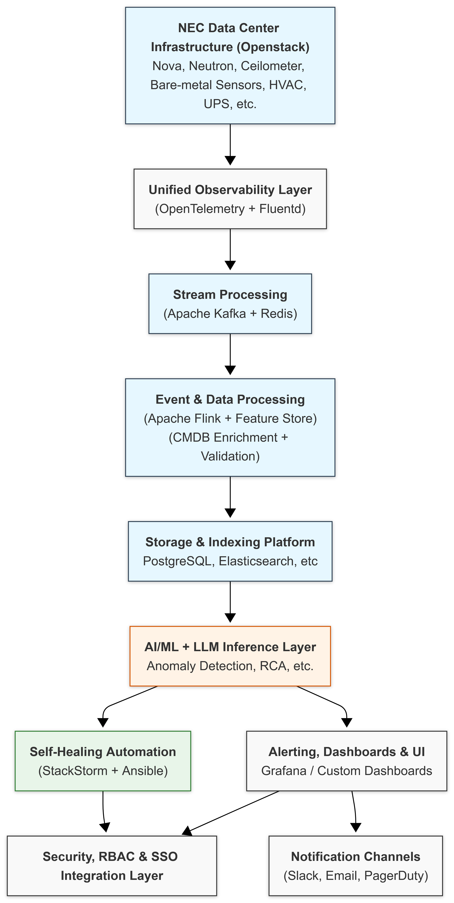

**Proposal: Proof of Concept for AI-Driven Data Center Operations**

**Submitted by:** Kawai in partnership with bld.ai\
**Client:** NTT Singapore\
**Duration:** 12 Weeks

---

### **1. Executive Summary**

Kawai, in collaboration with bld.ai, proposes a Proof of Concept (PoC) project for NTT Singapore that leverages advanced AI and open-source technologies to enhance data center (DC) operations. The PoC will demonstrate four key capabilities: self-healing infrastructure, a private LLM platform for operations intelligence, alarm correlation for root cause analysis, and predictive maintenance using sensor-driven data. This initiative lays the groundwork for a scalable, production-ready system.

---

### **2. Objectives**

- **Self-Healing**: Automatically detect and remediate issues like intermittent network outages, disk wear-out, and component failures.
- **Private LLM Platform**: Enable a secure AI platform trained on DC operations data to provide intelligent insights and summaries.
- **Alarm Correlation**: Identify root causes by correlating multiple simultaneous alarms using graph-based and temporal models.
- **Predictive Maintenance**: Monitor sensors (e.g., chillers, UPS) and proactively schedule maintenance using AI-based condition analysis.

---

### **3. Technical Approach**

The PoC will implement a **fully containerized, on-premise solution** using Kubernetes, Docker, and a suite of open-source tools. The system is designed to ensure modularity, scalability, and security.

#### **3.1 System Architecture, Observability & Automation Stack**

The following architecture will be implemented on a Kubernetes cluster:

##### 3.1.1 Data Sources

Logs, Metrics, Sensor Data are collected from OpenStack services (Nova, Neutron, etc.), bare-metal hardware, and facility systems (HVAC, UPS) using sources like Syslog, Ceilometer, SNMP, Modbus, and IPMI.

##### 3.1.2 Data Collection Layer

**OpenTelemetry Collector + Fluentd**: Deployed as Kubernetes DaemonSets, these unify logs, metrics, and traces into structured pipelines.

##### 3.1.3 Stream Processing

- **Apache Kafka** handles high-throughput event streams (e.g., logs).  
- **Redis Streams** support low-latency transmission for metrics and alerts.

##### 3.1.4 Real-Time Analytics

**Apache Flink** performs Complex Event Processing (CEP) for correlation, pattern detection, and temporal rule evaluation.

##### 3.1.5 Enrichment & Validation

- **Feature Store (Feast)** stores engineered features for ML inference.  
- **Topology Enrichment** augments events with CMDB and asset graphs.  
- **Data Quality Validator** ensures data consistency via schema and threshold checks.

##### 3.1.6 Storage & Indexing

Structured and unstructured data is stored across:

- **PostgreSQL** (relational data)  
- **Elasticsearch/OpenSearch** (log indexing)  
- **VictoriaMetrics** (time-series metrics)

##### 3.1.7 AI/ML & LLM Platform

Containerized AI workloads run on Kubernetes using GPU-enabled nodes.

Includes:

- **Anomaly Detection** (TSFormer, Temporal CNN)  
- **Predictive Maintenance** (DeepAR)  
- **Alarm Correlation** (Graph Neural Networks, Causal Inference)  
- **Log Summarization** (LogBERT, LogGPT)

Orchestration managed with **MLFlow** and **Kubeflow** for lifecycle management.

##### 3.1.8 Inference & Automation

- **LLM Inference Engine**: Powered by vLLM or Triton with LangChain and RAG over a vector DB (e.g., FAISS) for fast semantic retrieval.  
- **Self-Healing Engine**: Automates remediation using StackStorm workflows and Ansible playbooks.

##### 3.1.9 Visualization & Alerting

**Grafana / Custom Dashboards** provide real-time insights.

Notifications are routed to channels like **Slack**, **Email**, and **PagerDuty**.

##### 3.1.10 Security & Access Control

**RBAC**, **SSO Integration**, and **IAM policies** ensure secure access per tenant and role.
##### 3.1.11 Description of Key Components

- **OpenTelemetry / Fluentd**: Deployed as DaemonSets in the Kubernetes cluster for collecting logs, metrics, and traces from OpenStack services, infrastructure sensors (SNMP, Modbus), and other sources.

- **Apache Kafka / Redis Streams**: Kafka handles high-throughput batch and event ingestion, while Redis Streams supports low-latency streaming for real-time analysis.

- **Apache Flink (CEP)**: Detects patterns such as intermittent network outages, power fluctuations, or disk failures using complex event processing logic.

- **Feature Store (Feast)**: Maintains time-aligned features (e.g., sensor metrics, logs, system states) required for training and inference across ML models.

- **Topology Enrichment (CMDB + Asset Graphs)**: Enhances raw event data with contextual information like device relationships, service dependencies, and rack location.

- **Data Quality Validator**: Ensures integrity and consistency of incoming data using schema enforcement and threshold checks to avoid model drift or false positives.

- **Storage & Indexing**:  
  - **PostgreSQL** for structured metadata  
  - **Elasticsearch/OpenSearch** for logs  
  - **VictoriaMetrics** for time-series data

- **AI/ML & LLM Platform (K8s-based)**: Hosts a suite of models deployed on GPU-enabled nodes:
  - **TSFormer / Temporal Convolutional Network (TCN)**: Detects anomalies in time-series data such as temperature or voltage fluctuations from HVAC or UPS systems.
  - **DeepAR**: Forecasts future values like UPS battery life or disk failure based on historical trends in temperature, current draw, or vibration.
  - **Graph Neural Networks (GNN) / Causal Inference**: Correlate alarms across components to identify root causes, especially in multi-tenant environments.
  - **LogBERT / LogGPT**: Perform log summarization to extract human-readable insights from unstructured system logs.
  - **MLFlow + Kubeflow**: Manage training, deployment, and lifecycle tracking of models across environments.

- **LLM Inference Stack (vLLM / Triton, LangChain, FAISS, Vector DB)**: Performs intelligent retrieval, RAG-based summarization, and incident triaging using logs, KB articles, and topology data.

- **Self-Healing Engine (StackStorm + Ansible)**: Executes corrective actions (e.g., restart services, isolate faulty nodes) based on RCA outputs and predefined policies.

- **Alerting & UI (Grafana / Custom Dashboards)**: Presents real-time system status, anomaly alerts, and AI-generated insights to operators via dashboards.

- **Notification Channels**: Sends critical updates to relevant teams via Slack, Email, PagerDuty, etc.

- **Security & Access Control**: Ensures proper authentication (SSO), authorization (RBAC), and tenant isolation for all system components and dashboards.

#### **3.2 Key Technologies**

- **Data Collection**: OpenTelemetry Collector (DaemonSet), Fluentd
- **Streaming**: Apache Kafka, Redis Streams, Apache Flink (CEP)
- **Storage**: PostgreSQL, Elasticsearch, VictoriaMetrics, OpenSearch
- **AI/ML Models**: Anomaly Transformer, DeepAR, LogGPT, GNNs
- **LLM Inference**: vLLM, Triton Server with LangChain + FAISS for RAG
- **Automation**: StackStorm, Ansible
- **Visualization & Alerts**: Grafana, Custom Web UI, Slack, PagerDuty
- **Security**: Role-based Access Control (RBAC), IAM integration, SSO

#### **3.3 LLM Usage Strategy**

- For the PoC, prompt engineering will be used with open-source LLMs (e.g., Mistral, LLaMA3) rather than fine-tuning.
- Future iterations may consider fine-tuning for context-specific accuracy.

---

### **4. Project Phases & Timeline (12 Weeks)**

| Phase       | Duration | Activities                                            |
| ----------- | -------- | ----------------------------------------------------- |
| Calibration | 2 Weeks  | Data access, environment setup, pipeline mock testing |
| Build       | 7 Weeks  | System integration, ML model deployment, LLM pipeline |
| Validation  | 3 Weeks  | Scenario testing, PoC assessment, performance tuning  |

---

### **5. High-Level Use Cases & Assumptions**

#### **5.1 Self-Healing**

- Triggers: Network instability, disk threshold events, component faults
- Assumption: Access to telemetry/logs from OpenStack and system events

#### **5.2 Private LLM Platform**

- Triggers: Query logs, summaries, generate remediation steps
- Assumption: Sufficient historical logs and metadata available for indexing

#### **5.3 Alarm Correlation**

- Triggers: Concurrent alarms from sensors/infra
- Assumption: Alarm feed and asset topology (CMDB) are accessible

#### **5.4 Predictive Maintenance**

- Triggers: Sensor thresholds, environmental data
- Assumption: Structured time-series data from UPS, HVAC, sensors available

---

### **6. Budget Options (Tiered Delivery Plan)**

#### **Tier 1: Pro Bono / MVP Delivery – (\~$10K–$15K)**

**Goal**: Validate core feasibility and get stakeholder buy-in with minimal deployment

**Solution & Features**:

- Basic Kubernetes cluster setup (on-prem)
- Log and metric ingestion pipeline (OpenTelemetry + Kafka)
- Simple dashboard (Grafana) with static thresholds
- Basic Anomaly Detection (1 model deployed)
- No self-healing or LLM integration

**Key Milestones**:

- Week 1–2: Environment calibration
- Week 3–5: Data pipeline deployment + basic alerts
- Week 6: Demo and evaluation

**Included**:

- Core infrastructure
- Alerting UI
- Basic AI pipeline

**Deferred**:

- Self-healing actions
- Alarm correlation engine
- Private LLM + RAG components
- Full predictive maintenance

#### **Tier 2: Intermediate PoC Scope – (\~$30K–$45K)**

**Goal**: Showcase automation, intelligence, and modular ML/LLM capabilities

**Solution & Features**:

- All Tier 1 features
- Alarm correlation using GNN + CMDB-based enrichment
- Predictive maintenance with TS-based model (DeepAR)
- Self-healing engine with rule-based StackStorm flows
- LLM prototype for log summarization via prompt-engineering
- Partial RAG pipeline using FAISS + OpenSearch
- Security integration (RBAC, token-based access)

**Key Milestones**:

- Week 1–2: Calibration
- Week 3–6: AI pipelines and correlation engine
- Week 7–9: LLM-based summarization & self-healing
- Week 10: Integration testing
- Week 11–12: Demo and feedback sessions

**Included**:

- ML models + LLM inference setup
- Enriched alerting and dashboards
- Basic self-healing actions
- Basic RAG retrieval

**Deferred**:

- Full ML lifecycle automation (MLflow/Kubeflow)
- SLA-ready notification system
- Production hardening

#### **Tier 3: Full Scope Production-Ready PoC – (\~$70K–$95K)**

**Goal**: Deploy a near-production environment that transitions seamlessly to a full system

**Solution & Features**:

- All Tier 2 features
- Advanced log summarization and remediation generation via LLM (LogGPT, LangChain)
- Full-featured RAG stack with vector DB and custom knowledge base
- Advanced predictive maintenance using sensor fusion models
- ML lifecycle support (MLFlow, Kubeflow Pipelines)
- Full RBAC/SSO, IAM integration
- Notification integrations: Slack, PagerDuty, email
- Custom Web UI + API gateway for integration

**Key Milestones**:

- Week 1–2: Infra setup and baseline pipelines
- Week 3–6: Advanced ML/LLM components
- Week 7–10: End-to-end scenario validation
- Week 11–12: Transition planning + final demo

**Included**:

- All PoC components fully integrated
- Production-level scalability + documentation
- API exposure + integration guidelines

**Deferred**:

- Long-term SLA agreements
- Deployment to multi-region clusters
- Continuous fine-tuning of LLMs

---

### **7. Commercial Terms Outline**

- **POC Scope**: All IPs developed will be available for assessment by NTT.
- **Transition to Production**:
  - Conditional on successful PoC validation
  - Additional licensing, support, and SLA agreements to be discussed
  - bld.ai will assist in handover, deployment guides, and documentation
- **Licensing**: All components used are open-source; licensing terms to be reviewed during production negotiation.

---

### **8. Deliverables**

- Fully functional PoC deployed on-premise in Kubernetes cluster
- Architecture documentation & deployment guide
- ML/LLM pipelines and workflow scripts
- Dashboard & alerting interface
- Evaluation report with recommendations for production readiness

---

### **9. Risks & Assumptions**

#### **9.1 Assumptions**

- NEC/NTT will provide access to relevant log, metric, and sensor data (e.g., from OpenStack, SNMP, Modbus, etc.)
- NEC/NTT will provision sufficient compute resources (e.g., VMs, GPU nodes, storage) for the deployment of the PoC platform
- Internet access is available (or access to a private container registry is provided) for pulling open-source components and images
- Stakeholders are available for reviews and validation during key milestones (e.g., Week 6 and Week 12)

#### **9.2 Risks**

- Limited or delayed access to production-like datasets may impact the effectiveness of ML/LLM components
- Security policies may restrict installation of monitoring agents or data collectors
- Insufficient GPU resources may impact LLM-based log summarization and inference speed
---

### **10. Contact**

**Kawai / bld.ai Project Coordination Team**

Prof. Masroor Hussain\
masroor.hussain@gmail.com

Dr. Usman Haider\
usmanhaider95@gmail.com

Muhammad Sajid Ali\
sajidali770@yahoo.com

18 July, 2025

---

**End of Proposal**
